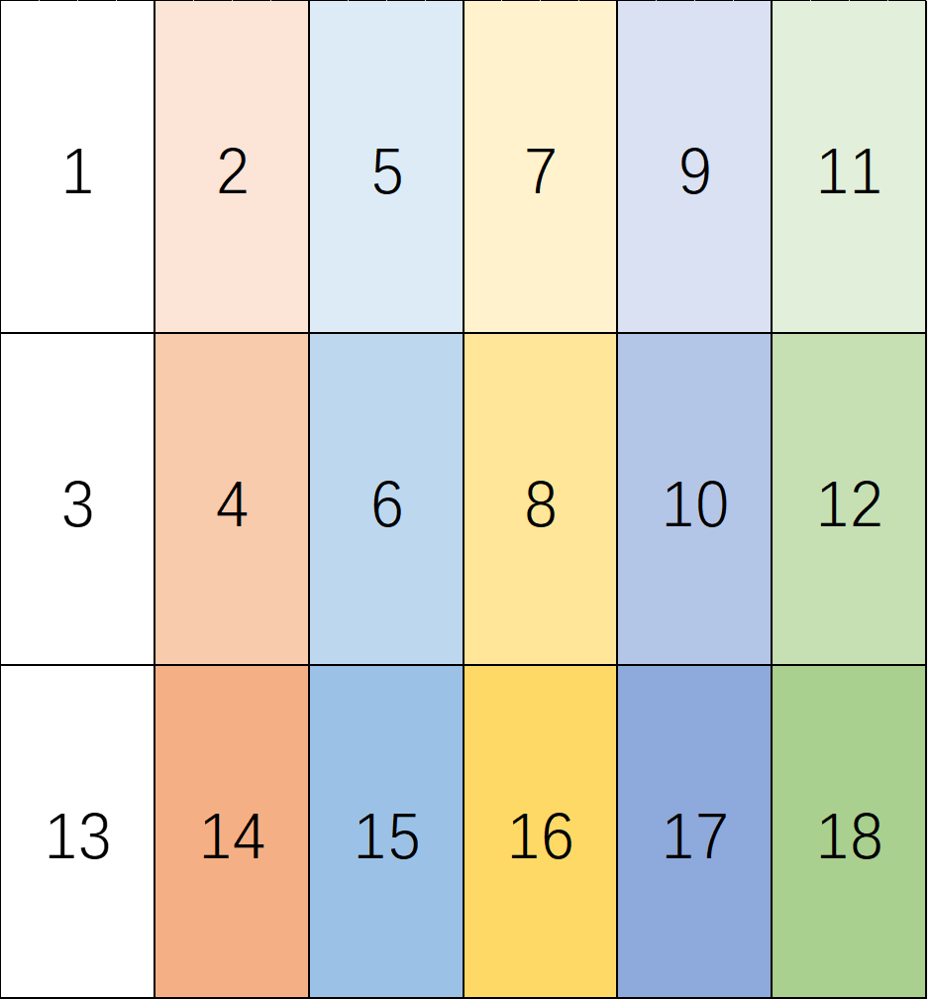

# 历史

## 2.1. 第二周 第二次

### 2.1.1. 已定

总架构：

1. 确定了电路的SADPC >= 10*
2. 确定了电路的架构为单大核
3. 确定了工作分为IO buffer与Core两组
4. 确定了大核与IO buffer的通信速率为32B每周期**

> *：129600\*256\*60/200M=9.95
> **：(23^2+64)/ceil(256/10)=24 B

Core：

1. 总的架构分为16个小核，与一个cache通信
2. cache的大小为10*32B
3. 小核内需要AD模块、加法树、max模块
4. 确定了32B块的读入顺序：*

首先在-2T和-1T内，分两次发送小块的*补码*；在剩下的周期内按如下顺序发送大块：

>*：注意该图最左上角的像素为[-7,-7]，最右下角像素为[9,9]，在发包时，9行9列的数据填充0即可

### 2.1.2. 待定

Core：

1. 绝对差算法
2. 加法树种类
3. max算法
4. 采用何种的流水线与并行度

## 2.2. 第二周 第一次

### 2.2.1. 已定

1. 确定了电路输出的结果可以用脚本重新组织
2. 确定了平均IO带宽在950MB/s*
3. 确定了最高频率不超过100MHz*

> 2\*1B\*3840\*2160\*60fps=950 MB/s

### 2.2.2. 未定

1. 探索了在四核架构下的三种搜索方式
   - 斜向排列
   - 线性排列
   - 田字形排列

### 2.2.3. 待定

1. 大块搜索：大块几核？如何排列？如何移动？
2. 小块搜索：

> *：注意到在100MHz下，IO已经需要达到9.5B/周期，可能需要为了IO提高频率
